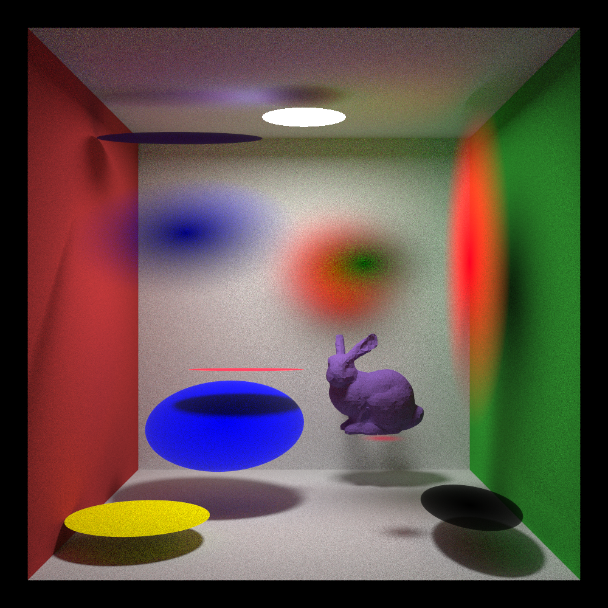
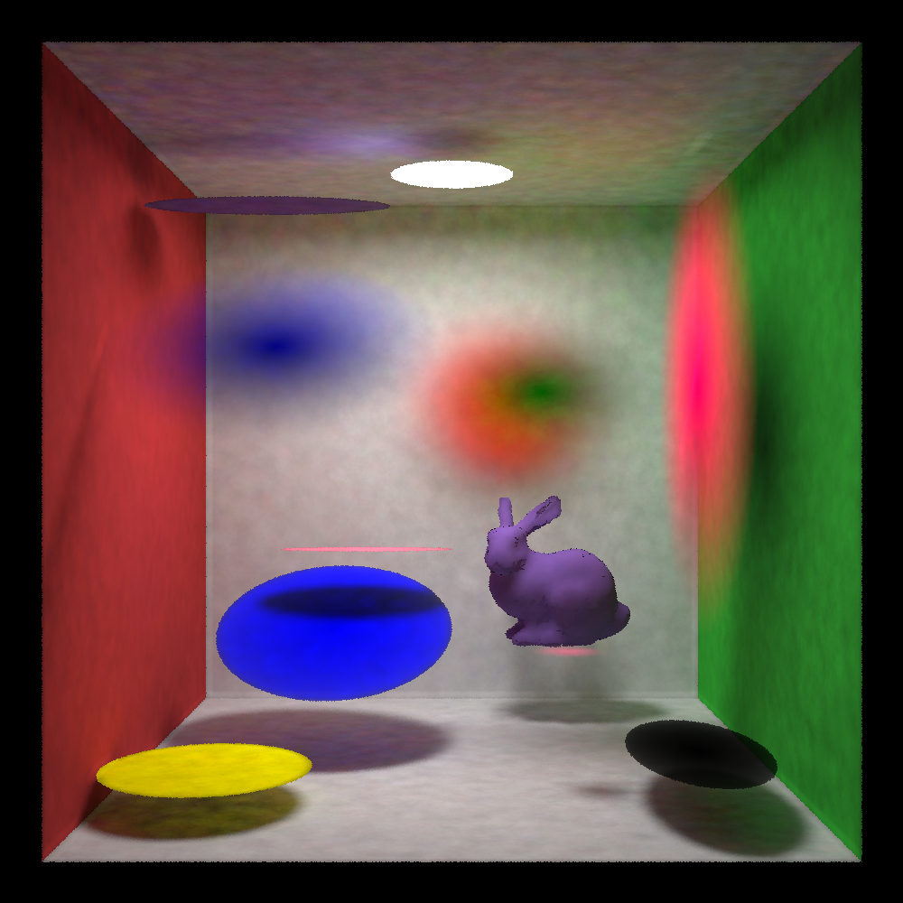

## Overview

This project is a **SYCL 2020 compliant** physically based differentiable renderer. It must be compiled with a **SYCL 2020 compliant compiler toolchain**. The setup below uses **LLVM/Clang 20** together with **AdaptiveCpp (ACPP)** on **Ubuntu 24.04**.

To render the included test scene, the required steps are:

- Install the base system dependencies
- Install **LLVM/Clang 20**
- Install **AdaptiveCpp (ACPP)**, providing **SYCL 2020** compilation support
- Clone this repository **with submodules**
- Configure the project with **CMake** using the **ACPP toolchain**
- Build the renderer
- Run the test scene


## Building on Ubuntu 24.04

The project is tested to build on a clean Ubuntu 24.04 setup with LLVM/Clang 20 and AdaptiveCpp.

### Requirements
- A fresh Ubuntu 24.04 install

### 1. Install base system dependencies

```bash
sudo apt update
sudo apt install -y \
  ca-certificates \
  curl \
  wget \
  gnupg \
  git \
  pkg-config \
  build-essential \
  ninja-build \
  cmake \
  python3 \
  python3-pip \
  python3-dev \
  libpython3-dev \
  zlib1g-dev \
  xz-utils \
  libopenexr-dev
```

### 2. Install LLVM/Clang 20 from apt.llvm.org


```bash
apt install lsb-release wget software-properties-common gnupg

wget https://apt.llvm.org/llvm.sh
chmod +x llvm.sh
sudo ./llvm.sh 20
rm llvm.sh
```

Install the LLVM 20 development packages required by this project and AdaptiveCpp:

```bash
sudo apt update
sudo apt install -y \
  llvm-20-dev \
  llvm-20-tools \
  libclang-20-dev \
  libclang-common-20-dev \
  lld-20 \
  libomp-20-dev
```

Set convenient defaults for the current shell:

```bash
export CC=clang-20
export CXX=clang++-20
```

Optional: To make this persistent, add both lines to `~/.bashrc`.

### 3. Install AdaptiveCpp

```bash
git clone https://github.com/AdaptiveCpp/AdaptiveCpp.git
cmake -S AdaptiveCpp -B AdaptiveCpp/build \
  -G Ninja \
  -DCMAKE_BUILD_TYPE=Release \
  -DCMAKE_INSTALL_PREFIX=/opt/AdaptiveCpp \
  -DCMAKE_C_COMPILER=clang-20 \
  -DCMAKE_CXX_COMPILER=clang++-20 \
  -DLLVM_DIR=/usr/lib/llvm-20/cmake \
  -DACPP_COMPILER_FEATURE_PROFILE=full
cmake --build AdaptiveCpp/build -j"$(nproc)"
sudo cmake --install AdaptiveCpp/build
```

Expose AdaptiveCpp to your shell:

```bash
export PATH=/opt/AdaptiveCpp/bin:$PATH
export CMAKE_PREFIX_PATH=/opt/AdaptiveCpp:$CMAKE_PREFIX_PATH
```

Optional: To make this persistent, add both lines to `~/.bashrc`.

### 4. Clone the repository

Clone with submodules:

```bash
git clone --recurse-submodules https://github.com/M-Gjerde/DifferentiablePointRendering.git
cd DifferentiablePointRendering
```

If you already cloned the repository without submodules:

```bash
git submodule update --init --recursive
```

### 5. Configure the project

Note: Build in debug mode, Release mode doesn't work due to clang compiler crash caused by SYCL combined with c++ modules.

```bash
cmake -S . -B build \
  -G Ninja \
  -DCMAKE_BUILD_TYPE=Debug \
  -DCMAKE_C_COMPILER=clang-20 \
  -DCMAKE_CXX_COMPILER=clang++-20 \
  -DCMAKE_PREFIX_PATH=/opt/AdaptiveCpp
```

### 6. Build

```bash
cmake --build build -j"$(nproc)"
```

## Render a test scene:
```bash
cd build
./DifferentiablePointRendering points.ply cbox.xml
```
You should end up with two rendered images like this:

(Left: Light tracing rendering. Right: Photon mapping)
<p align="center">   </p> ```

### Troubleshooting

If CMake cannot find AdaptiveCpp, verify that these environment variables are set:

```bash
export PATH=/opt/AdaptiveCpp/bin:$PATH
export CMAKE_PREFIX_PATH=/opt/AdaptiveCpp:$CMAKE_PREFIX_PATH
```

If the repository was cloned without submodules, run:

```bash
git submodule update --init --recursive
```


### Optional: build Python bindings
Python bindings builds a python library of the renderer.
Note: Build in debug mode, Release mode doesn't work due to clang compiler crash caused by SYCL combined with c++ modules.
```bash
cmake -S . -B build \
  -G Ninja \
  -DCMAKE_BUILD_TYPE=Debug \
  -DCMAKE_C_COMPILER=clang-20 \
  -DCMAKE_CXX_COMPILER=clang++-20 \
  -DCMAKE_PREFIX_PATH=/opt/AdaptiveCpp \
  -DBUILD_PYBIND=ON

cmake --build build -j"$(nproc)"
```